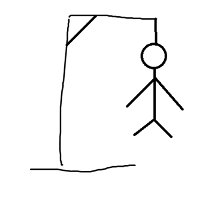
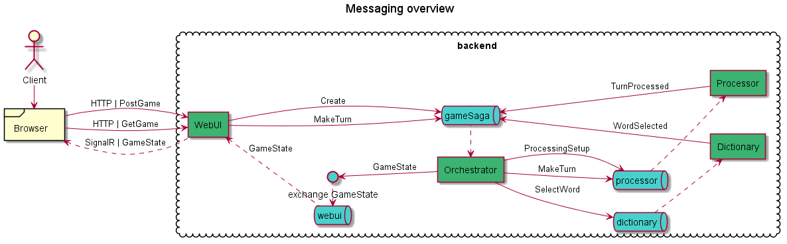
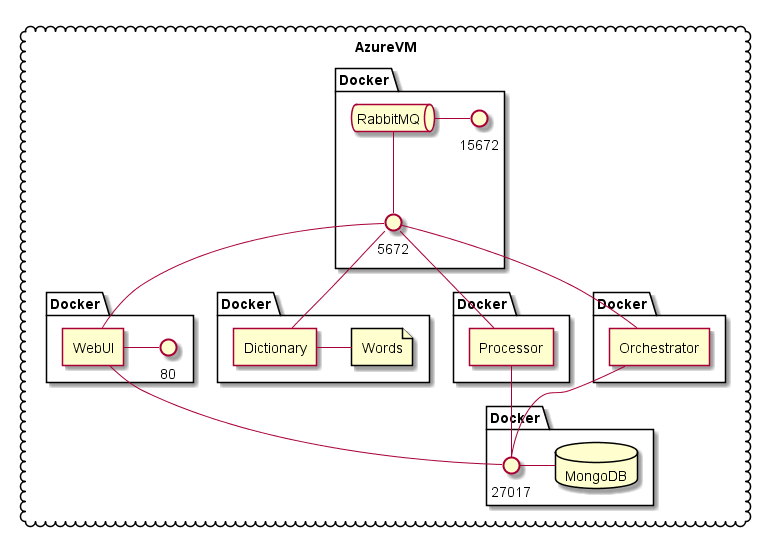
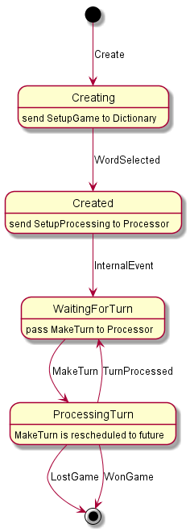

# Hangman game

A simple game to demonstrate RabbitMQ + MassTransit + Saga

## Next steps

### Run / Debug Solution locally

- clone source files
- you will need a Visual Studio and Docker with docker-compose
- use "docker-compose -f dev.yaml" to setup development environment
- activate following projects in Visual Studio
  - Hangman.WebUI
  - Hangman.Orchestrator
  - Hangman.Dictionary
  - Hangman.Processor
- run the Solution

### Goto documentation

- RabbitMQ https://www.rabbitmq.com/
- MassTransit https://masstransit-project.com/MassTransit/quickstart.html
- Sagas
  - Original Princeton paper http://www.cs.cornell.edu/andru/cs711/2002fa/reading/sagas.pdf
  - Arnon Rotem-Gal-Oz's description http://www.rgoarchitects.com/Files/SOAPatterns/Saga.pdf

## Architecture

### Messaging

### Deployment

### Discover the sources

- **build** - bat files to automate docker image build
- **compose** - docker compose scripts to setup develop and production environments
  - **dev.yaml** - script to setup developer's environment
  - **prod\\** - set of files to run production environment using docker-compose
- **src** - sources for backend and frontend
  - **Hangman.Core** - common assets 
  - **Hangman.Dictionary** - service providing a random word
  - **Hangman.Dictionary.Consumers** - business logic for Dictionary service
  - **Hangman.Messaging** - contracts for message bus: commands, queues, helpers
  - **Hangman.Orchestrator** - service hosting saga logic
  - **Hangman.Persistence** - set of models and providers for database access (MongoDB)
  - **Hangman.Processor** - service for turn calculation
  - **Hangman.Processor.Consumer** - business logic for Processor service
  - **Hangman.WebUI** - web-service, hosting user frontend and related API
  - **Hangman.Workflow** - business logic for Saga
  - **Hangman.Workflow.Tests** - unit tests for Saga

### Saga state machine

  

